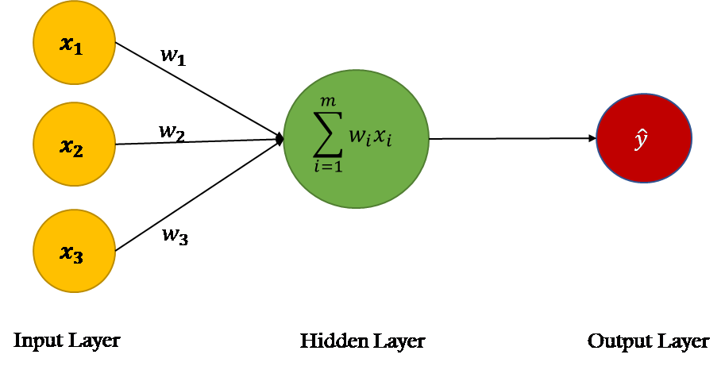

# Linear Perceptron Classifier

## Description

This project is an implementation of a handwritten digit recognition model
using the Single-Layer Perceptron learning algorithm.

##

##

## Instructions to run

1. Create a virtual environment
   - `$ python3 -m venv myvenv`
2. Activate the virtual environment
   - `$ source myvenv/bin/activate`
3. Install the requirements
   - `$ pip install -r requirements.txt`
4. Run the tests
   - `$ python test_feature_extraction.py`
5. Run the main script
   - `$ python main.py`
6. Deactivate the virtual environment
   - `$ deactivate`

## Resources

- [Single-Neuron Perceptron](https://itnext.io/creating-a-single-neuron-model-perceptron-5731aaf36a54)

- [Abstract Syntax Trees](https://docs.python.org/3/library/ast.html)
